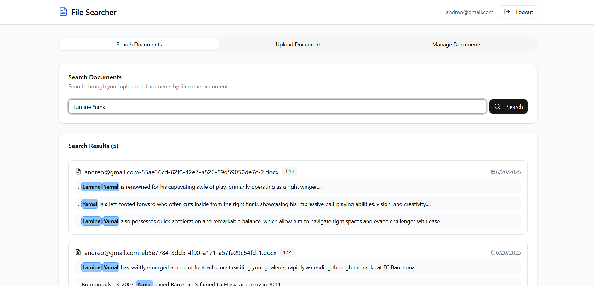

# Document Search 📄🔍

Upload PDF and Word documents, have their contents indexed automatically, and run full-text searches with highlighted matches. A React frontend on top of an event-driven AWS serverless backend.



## 🏗️ Architecture

```text
 React (Amplify)
       |
       |  1. request presigned URL
       v
 API Gateway --> Lambda --> DynamoDB (document metadata)
       |
       |  2. direct browser upload
       v
     S3  --(object created notification)-->  SQS
                                              |
                                              v
                                  Lambda (parse PDF / DOCX)
                                              |
                                              v
                                    OpenSearch (full-text index)
       ^
       |  3. search query
 API Gateway --> Lambda --> OpenSearch (highlighted hits)
```

SQS sits between S3 and the parser so a burst of uploads is absorbed rather than throttling Lambda, and a failed parse can be retried without losing the event.

## 🔍 Description

This project provides a comprehensive solution for managing and searching document content. Users can securely upload PDF and Word files, which are then processed and indexed to allow for powerful text-based searches. The application features document listing, search with text highlighting, and deletion capabilities, all powered by AWS's serverless architecture.

## 🚀 Features

*   **Secure User Authentication (Emulated):** User email is stored locally to emulate authentication.
*   **Document Upload:**
    *   Upload single `.pdf` or `.docx` files.
    *   Frontend requests pre-signed URLs from the backend for direct and secure S3 uploads.
*   **Automated File Processing:**
    *   AWS S3 sends notifications to AWS SQS upon file upload.
    *   AWS Lambda functions are triggered by SQS messages to process files.
    *   Parsing of PDF/Word content to extract text (using a suitable library).
    *   Indexed text stored in AWS OpenSearch for efficient full-text search.
*   **Document Management:**
    *   **List Documents:** View uploaded documents with filenames and upload dates.
    *   **Search Documents:** Perform full-text searches across document content.
        *   Search results display filenames and highlight the relevant parts of the text where the search query was found.
    *   **Delete Documents:** Endpoint to delete documents, ensuring removal from the database, OpenSearch index, and S3 bucket.
*   **Responsive UI:** Built with React, TailwindCSS, and ShadCN UI for a modern and adaptable user experience.

## 🛠️ Tech Stack

### Frontend

*   **React 19**
*   **Vite** (build tool)
*   **TailwindCSS**
*   **ShadCN UI** (UI components)
*   **@tanstack/react-query** (data fetching and caching)
*   **Axios** (HTTP client)
*   **Sonner** (toasts/notifications)
*   **uuid** (unique ID generation)
*   **Lucide React** (icons)

### Backend & AWS Services

*   **AWS API Gateway:** Serves as the entry point for client-server interactions.
*   **AWS Lambda:** Serverless compute for backend logic (triggered by API Gateway and SQS).
*   **AWS S3:** Scalable object storage for uploaded files.
*   **AWS SQS:** Message queuing service for decoupling file uploads from processing.
*   **AWS DynamoDB:** NoSQL database for storing document metadata
*   **AWS OpenSearch:** Managed service for full-text search and analytics, used to index PDF/Word content and handle search queries with highlighting.
*   **AWS Amplify:** Hosting for the React frontend application.

## ⚙️ Installation

### 1. Clone the Repo

```bash
git clone https://github.com/32andrii23/document-search.git
cd document-search
```

### 2. Install Dependencies

The React app lives at the repository root, so there is no separate client directory:

```bash
npm install
```

### 3. Configure Environment

```bash
cp .env.example .env
```

Then fill in the two values (see [Environment Variables](#-environment-variables) below).

## 🧪 Running Locally

```bash
npm run dev
```

The app expects a deployed backend. The AWS side is Lambda functions behind API Gateway plus an S3/SQS-triggered indexer, so there is no local server to start — point `VITE_API_URL` at a deployed API Gateway stage, or emulate it with AWS SAM CLI or the Serverless Framework.

## 🔐 Environment Variables

Copy `.env.example` to `.env` and set:

| Variable | Description |
| --- | --- |
| `VITE_API_URL` | API Gateway base URL, e.g. `https://your-api-id.execute-api.us-east-1.amazonaws.com` |
| `VITE_AWS_S3_BUCKET_NAME` | S3 bucket that receives uploaded documents |

## 📬 Deployment

- **Client:** AWS Amplify
- **Backend:** Lambda, API Gateway, SQS, S3, DynamoDB, and OpenSearch

- Backend: Deployed using AWS services (Lambda, API Gateway, SQS, S3, DynamoDB, OpenSearch).
